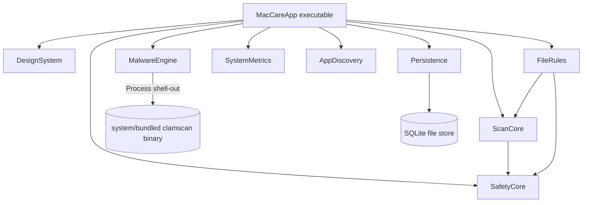
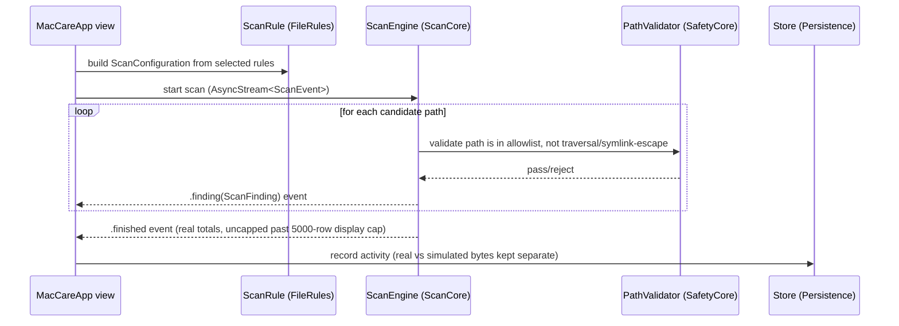
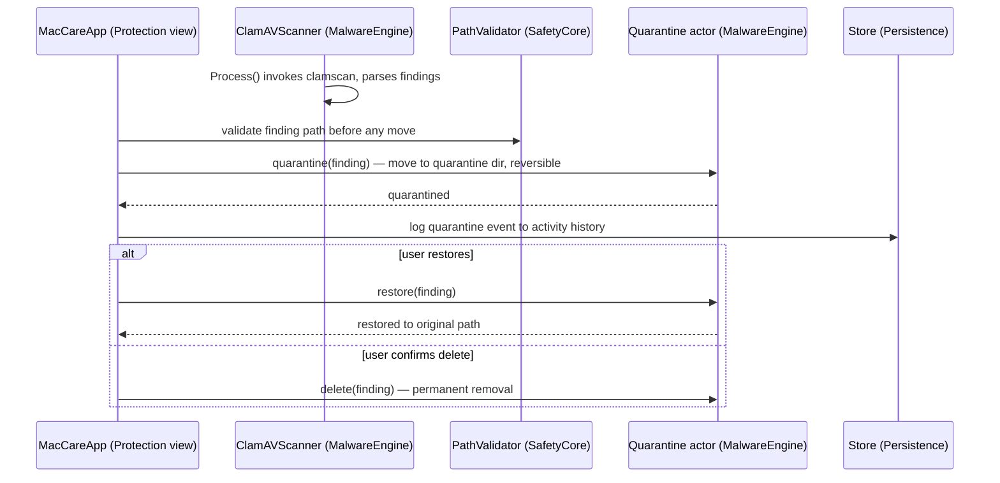
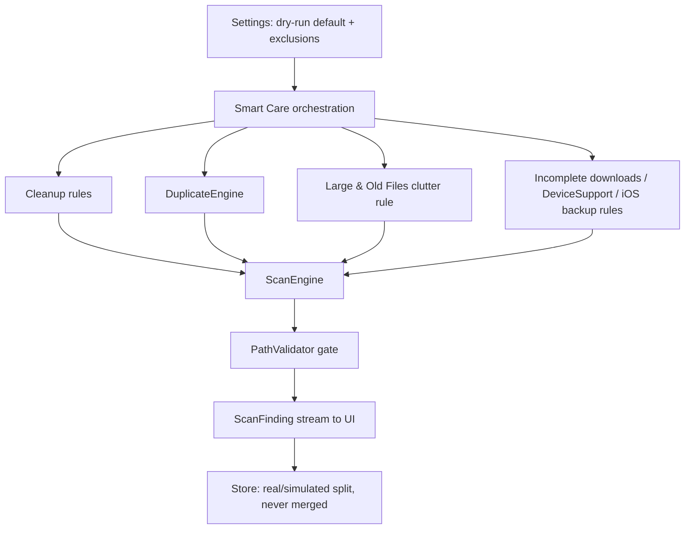

# Architecture Inventory — Audit Session 1

Evidence: `Package.swift`, `Sources/` tree walk, and `grep -n "^public\|^actor\|^struct\|^enum\|^final class"`
on each target's top-level files, commit `b33c06b8d68b9b03316821c3f6cfb17252f35011`.

## Targets (from Package.swift, swift-tools-version 6.0)

| Target | Kind | Dependencies | Lines | Tests |
|---|---|---|---|---|
| MacCareApp | executable | ScanCore, SafetyCore, FileRules, DesignSystem, Persistence, SystemMetrics, AppDiscovery, MalwareEngine | 4260 | MacCareAppTests (27 tests) |
| DesignSystem | library | none | 887 | DesignSystemTests (9) |
| ScanCore | library | SafetyCore | 659 | ScanCoreTests (21) |
| Persistence | library | none | 278 | PersistenceTests (5) |
| AppDiscovery | library | none | 217 | AppDiscoveryTests (3) |
| SafetyCore | library | none | 170 | SafetyCoreTests (13) |
| MalwareEngine | library | none | 160 | MalwareEngineTests (4) |
| SystemMetrics | library | none | 142 | SystemMetricsTests (1) |
| FileRules | library | ScanCore, SafetyCore | 110 | FileRulesTests (3) |

Zero external SwiftPM dependencies declared (`Package.swift` has no `.package(url:...)` entries).

## Key public types (by target, file:line from grep)

- **SafetyCore** (`Sources/SafetyCore/SafetyCore.swift`): `RiskLevel` enum, `SafetyError` enum,
  `PathValidator` struct (allowlist/traversal/symlink-escape checks — 13 tests cover this alone, the
  most heavily tested single type in the repo), `ApprovedFileOperation`, `SafetyCenter` actor.
- **ScanCore**: `ScanEngine` struct (AsyncStream-based scan orchestration, `ScanCore.swift:103`),
  `DuplicateEngine` (`DuplicateEngine.swift:24`), `SpaceLensEngine` + `TreemapLayout`
  (`SpaceLensEngine.swift:40,155`), `SimilarImagesEngine` (`SimilarImagesEngine.swift:34`). All four
  engines expose `Sendable` event enums (`ScanEvent`, `DuplicateEvent`, `SpaceLensEvent`,
  `SimilarImagesEvent`) streamed to the UI layer.
- **FileRules**: declarative `ScanRule`/cleanup-rule definitions consumed by ScanCore; `UserCleanupRulesTests`
  assert `noRuleTargetsUserContent()` — i.e. a test exists that specifically checks the rule set can't
  target user-owned content, not just that rules exist.
- **Persistence**: `Database` (`Database.swift:16`, `final class`, not `Sendable`-marked itself but
  wrapped by `Store`), `Store` actor (`Store.swift:30`) — actor-isolated SQLite access; `ActivityRecord`
  struct. Migrations verified idempotent by `StoreTests.migrationsApplyOnceAndAreIdempotent`.
- **MalwareEngine**: `ClamAVScanner` struct (`MalwareEngine.swift:30`) — contains the repo's only
  `Process()` invocation at `MalwareEngine.swift:56`, shelling out to a ClamAV binary; `Quarantine` actor
  (`MalwareEngine.swift:100`) providing reversible quarantine/restore/delete.
- **AppDiscovery**, **SystemMetrics**, **DesignSystem**: smaller, single-purpose libraries (app
  inventory/uninstall support, live system metrics snapshotting, and design tokens/colors/geometry
  respectively).

## Concurrency posture (evidence: grep)

- `@MainActor` used in 18 files (mostly `MacCareApp` views/view-models, per naming convention).
- `AsyncStream` used in 4 files — the four ScanCore engines' streaming-event APIs.
- Persistence and MalwareEngine's mutable state is actor-isolated (`Store`, `SafetyCenter`, `Quarantine`
  are all `actor`), consistent with avoiding shared mutable state across the async scan/cleanup flows.
- Single `Process()` shell-out in the entire codebase: `Sources/MalwareEngine/MalwareEngine.swift:56`
  (feeds the later security audit — this is the one place the app executes an external binary).

## Diagrams (based on the types/dependencies actually read above, not invented)

### 1. Global architecture

### 2. Scan flow (Smart Care / Cleanup, via ScanEngine)

### 3. Delete / restore (quarantine) flow

### 4. Smart Care orchestration (dry-run by default)

## Not yet audited this session

- Full call-graph / view-model wiring inside `MacCareApp` (4260 lines, largest target) beyond the
  flows above — deferred to session 2 module-by-module inventory.
- Whether every `Process()`-adjacent path is covered by the security audit's threat model — flagged,
  not analyzed in depth (session 2).
