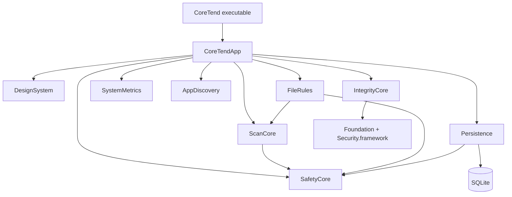
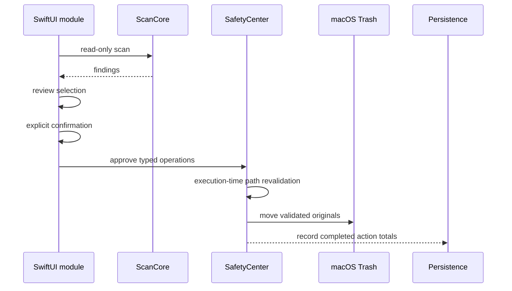

# Architecture inventory — current rc.5 candidate

Generated from `Package.swift` and the current `Sources/` tree on 2026-08-02.

| Target | Kind | Responsibility | Swift lines |
|---|---|---|---:|
| CoreTend | executable | Minimal application entry point | 3 |
| CoreTendApp | library | SwiftUI shell, modules, onboarding and settings | 7,687 |
| DesignSystem | library | Tokens, shared components and motion | 1,280 |
| ScanCore | library | Scan, duplicate, similar-image and Space Lens engines | 888 |
| SafetyCore | library | Path validation, typed approvals and Trash execution | 248 |
| FileRules | library | Declarative cleanup rules and allowlists | 162 |
| Persistence | library | Actor-isolated SQLite store and legacy migration | 986 |
| SystemMetrics | library | Local CPU, memory, disk and thermal metrics | 142 |
| AppDiscovery | library | Installed-application and update-mechanism inventory | 413 |
| IntegrityCore | library | Native provenance, signature and login-item signals | 212 |

`CoreTendApp` depends on the eight library modules. `ScanCore` depends on
`SafetyCore`; `FileRules` depends on both; `Persistence` depends on
`SafetyCore`. IntegrityCore has no external engine or subprocess.

## Cleanup execution boundary

There is no preview-mode switch in the current product. Historical database
columns and migration filters remain only so an upgrade can safely ignore old
preview records without breaking an existing store.

## Integrity boundary

Integrity is informational and read-only. It reads macOS-owned metadata and
never claims to detect malware, never quarantines a file and never invokes an
external scanner. Tests cover provenance parsing, signature classification,
malformed inputs and login-item parsing.
