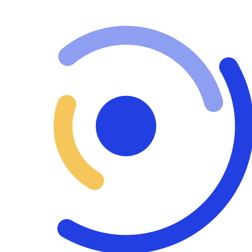
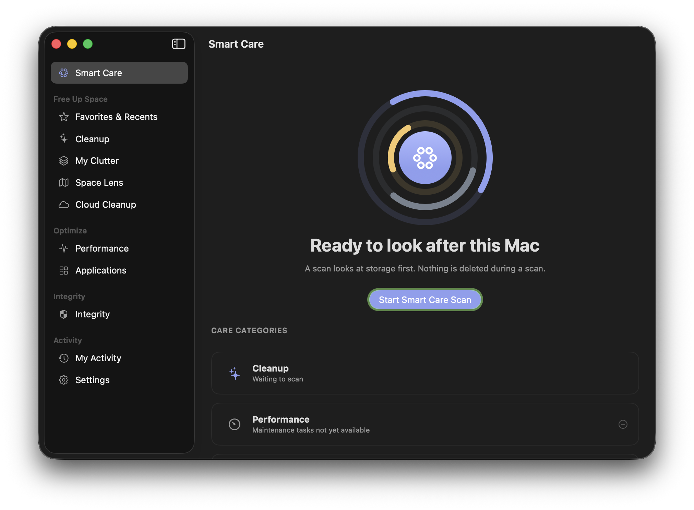
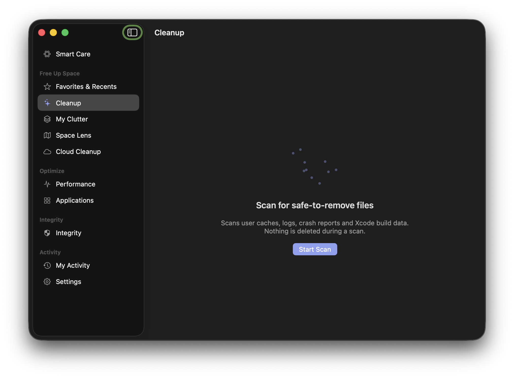
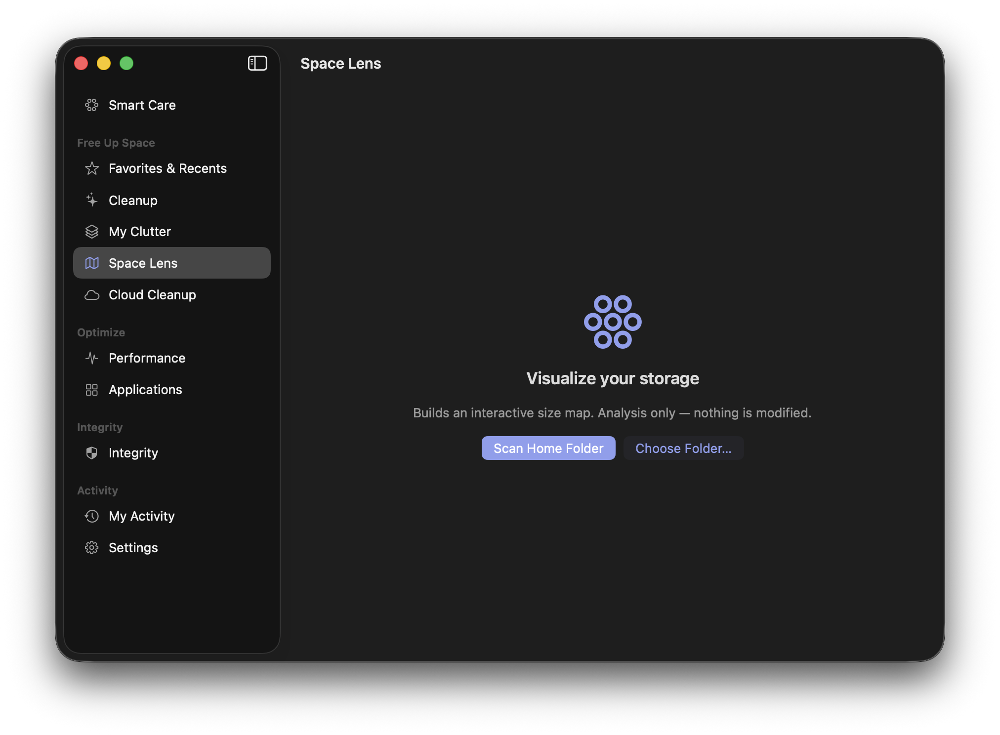
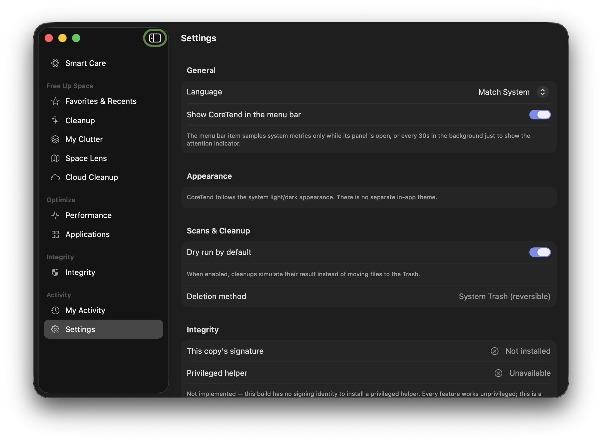
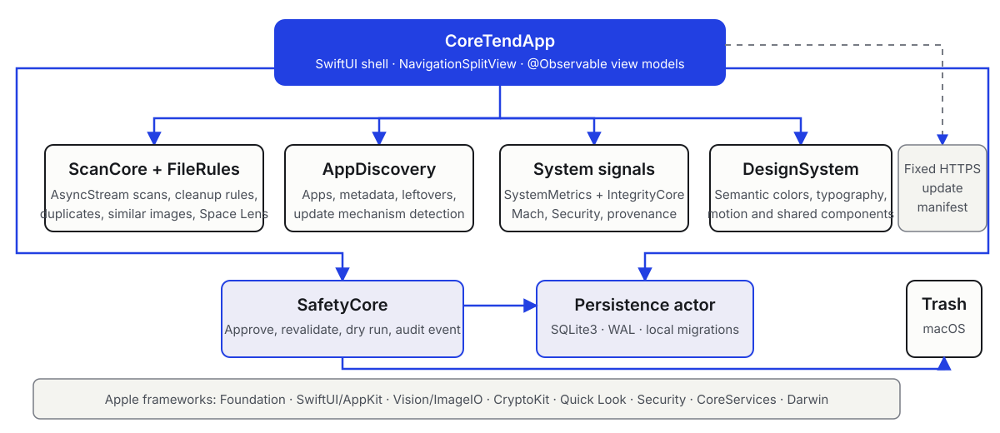
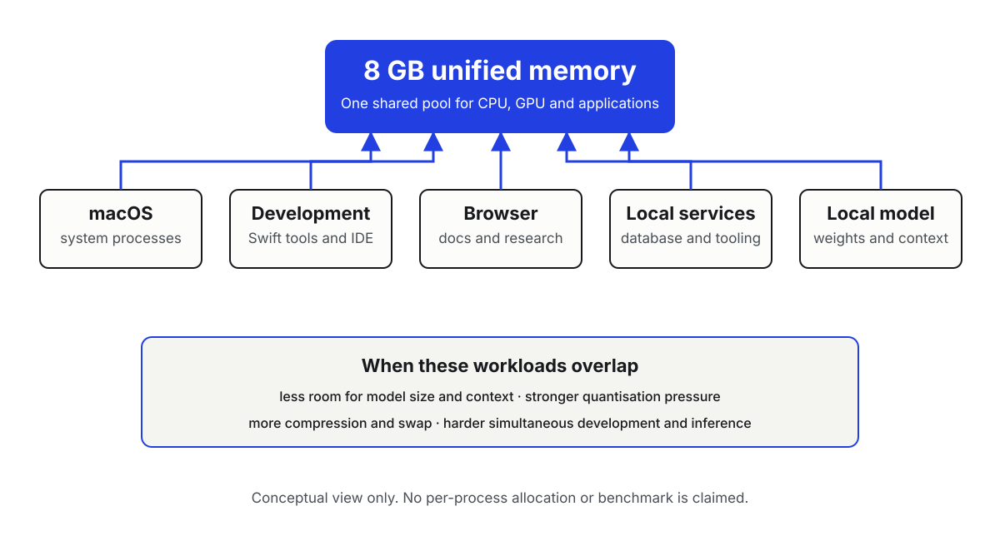

<!-- PAGE:cover -->

Independent student proposal · 31 July 2026

# Coretend — Student Software and AI Development Project

Hardware Support Proposal for Apple

<strong>Ahmet Basbunar</strong> Incoming second-year BUT Informatique student Application Development track

<strong>IUT de Metz, France</strong> <a href="https://ahmetbsbnr.com">ahmetbsbnr.com</a> Prepared for Apple Education, Developer Relations and the Office of the CEO

<!-- PAGE:executive -->

01 / Executive Summary

# A working project, ready for a larger learning horizon

I am Ahmet Basbunar, an incoming second-year BUT Informatique student in the Application Development track at IUT de Metz. I am building **Coretend**, a native macOS utility for storage exploration, cautious cleanup and audited, user-approved actions. The repository contains working SwiftUI modules, local SQLite persistence and safety controls. Coretend is under active development, not a finished commercial or App Store product.

Alongside it, I use local language models and development assistants to study inference, quantisation, context windows, runtime design and application integration. This work is separate: Coretend currently contains no LLM integration.

My MacBook Air with Apple M1 and 8 GB of unified memory has enabled four years of learning and creation. It now has limited headroom when local inference shares memory with macOS, development tools, a browser and services. Strong quantisation, shorter contexts and swap complicate simultaneous inference and development.

I respectfully seek access to a durable Mac with **24 or 32 GB of unified memory** through any suitable route, including refurbished or demonstration equipment, a long-term loan, donation, exceptional educational discount or programme guidance. The support would enable continued Coretend development, deeper MLX and Apple silicon work, documented experiments, open-source contributions, a stronger portfolio and internship preparation.

<strong>Native macOS work</strong>Swift 6, SwiftUI, AppKit and Apple frameworks.

<strong>Local by design</strong>No account or remote backend appears in source.

<strong>Focused request</strong>Memory and durability matter more than a premium model.

<!-- PAGE:developer -->

02 / About the Developer

# Learning by building end-to-end systems

I am an **incoming second-year BUT Informatique student** at IUT de Metz, Université de Lorraine, in France. My track, *Réalisation d’applications* (Application Development), aligns with the work I want to pursue: designing reliable software, understanding the systems beneath it and translating technical constraints into useful interfaces.

Coretend is the strongest current example of that approach. It requires more than interface work: scanning large file trees, coordinating asynchronous tasks, validating destructive actions, modelling state, persisting audit records, packaging a macOS application and keeping documentation aligned with a fast-moving codebase.

My ambition is to deepen both **native software engineering** and **applied AI**. I want to understand local-model execution rather than treating AI as a black box, then use that knowledge carefully where it can improve a real application.

I am registered with the Apple Developer programme. I am registered to continue into the second year of the BUT Informatique programme at IUT de Metz and have completed the required administrative steps, including obtaining my CVEC attestation. Supporting documentation regarding my student status can be provided upon request.

## Current profile

- Incoming second-year BUT Informatique student
- Application Development track
- IUT de Metz, France
- Native macOS and Swift development
- Local AI and runtime experimentation
- Registered Apple Developer

## Public work

[Portfolio](https://ahmetbsbnr.com)  
[GitHub](https://github.com/ahmetbsbnr)  
[LinkedIn](https://www.linkedin.com/in/ahmet-basbunar)  
[Coretend website](https://coretend.ahmetbsbnr.com)

**Authorship and tools.** I remain responsible for Coretend’s conception, implementation decisions and validation. AI assistants are used as learning, analysis and development aids, not represented as autonomous authors of the project.

<!-- PAGE:coretend-vision -->

03 / Coretend · Vision and Current Build

# Make Mac maintenance understandable and reversible

Many maintenance tools reduce storage decisions to a large number and a single action. Coretend is exploring a more transparent model: analyse locally, explain what was found, let the user review it, validate every approved path, default to simulation and move files to the macOS Trash rather than deleting them permanently.

The current source targets individual Mac users who want clearer storage information and cautious maintenance. It also includes Xcode-oriented cleanup rules useful to developers. There is no account system or hosted application backend in the repository.

> Coretend is currently under active development and is not presented as a finished commercial product.

<figure class="hero-shot">

<figcaption>Current-branch Smart Care interface, captured on macOS on 31 July 2026. The screen accurately shows the present limitation: Cleanup is available in this flow, while other care categories remain unavailable.</figcaption>
</figure>

<strong>0.9.1-rc.3</strong>Development bundle version; the source has continued to evolve beyond the tagged release-candidate checkpoint.

<strong>11 destinations</strong>Smart Care, Cleanup, Integrity, Performance, Applications, storage views, activity and Settings.

<strong>EN + FR</strong>English and French localisation resources are present with matching key sets.

<!-- PAGE:coretend-status -->

04 / Coretend · Evidence and Roadmap

# What is available, partial and next

<figure class="screenshot-card primary">

<figcaption><strong>Cleanup.</strong> The user starts a local scan, reviews grouped findings, and can keep the default dry-run or approve movement to Trash.</figcaption>
</figure>

<figure class="screenshot-card compact">

<figcaption><strong>Space Lens.</strong> An initial, analysis-only entry state with no personal folder contents exposed.</figcaption>
</figure>
<figure class="screenshot-card compact">

<figcaption><strong>Settings.</strong> Safety, language, exclusions and development-state controls.</figcaption>
</figure>

<h3>Available in source</h3>

- Ten cleanup rules, including caches, logs, crash reports and selected Xcode artefacts.
- Exact duplicate detection, large and old file analysis, similar-image analysis, and Space Lens storage exploration.
- Application inventory and reviewed move-to-Trash uninstall; live performance signals; native Integrity inspection.
- Local activity and safety records, diagnostics export, favourites and recents, English and French UI.

<h3>Partial</h3>

- Smart Care currently orchestrates Cleanup only. Performance and Applications remain unavailable within that combined flow, although their standalone screens are implemented.
- Cloud Cleanup is informational, Similar Images is analysis-only, and App Updates detects mechanisms rather than available versions.
- Privacy Cleaner moves browser caches only; history, cookies and sessions are deferred.

<h3>Next / planned work</h3>

- Extend Smart Care beyond Cleanup and propagate exclusions and safety settings consistently across specialised flows.
- Complete clean-machine validation, multi-macOS visual QA, documentation synchronisation, signing and notarisation work.

<!-- PAGE:architecture -->

05 / Technical Architecture

# A native, modular and safety-centred stack

<strong>Language</strong>Swift 6

<strong>Platform</strong>macOS 14+

<strong>Interface</strong>SwiftUI + AppKit

<strong>Storage</strong>SQLite3, WAL

<strong>Packaging</strong>Swift Package Manager

The application shell uses a SwiftUI `NavigationSplitView` and main-actor observable view models. Internal packages separate scanning and file rules, safety validation, application discovery, system and integrity signals, persistence and shared interface components. Scan engines return asynchronous streams so the interface can report progress without owning filesystem logic.

For a destructive action, the user first reviews results. `SafetyCore` validates the path, revalidates it immediately before execution, applies the dry-run state configured for that operation and records an audit event. Approved files are moved through the macOS Trash API. Activity, settings, exclusions, safety events and favourites are stored locally by an actor-backed SQLite layer; safety-log paths are redacted before storage. Propagation of the global dry-run preference across every specialised flow remains incomplete, although those flows independently default to simulation.

Apple frameworks in active use include Foundation, SwiftUI, AppKit, Vision, ImageIO, CryptoKit, Quick Look, Security, CoreServices and Darwin/Mach interfaces. **Core Data and SwiftData are not used.** The only declared external Swift package is Apple’s Swift Testing library, limited to test targets; no third-party runtime package is declared. UserNotifications is presently limited to an onboarding permission request; no scheduling implementation was found.

### Current engineering challenges

- Preserving path safety while supporting user-selected files.
- Scaling cancellable scans and image analysis without obscuring progress.
- Propagating exclusions and settings consistently across specialised engines.

### Boundaries

- Cloud Cleanup currently analyses local provider state only.
- The only wired update check is user-initiated; it fetches a fixed HTTPS manifest and never installs. An automatic-check preference exists, but no launch trigger is wired yet.
- Distribution signing, notarisation and broad clean-machine testing are not yet complete.

<!-- PAGE:ai -->

06 / AI and LLM Experience

# From using models to understanding their constraints

My AI work is an active learning track alongside Coretend. I use local models and development assistants to compare approaches, analyse code and explore how AI could eventually fit into privacy-conscious applications. The aim is not simply to call a model: it is to understand inference, quantisation, memory requirements, context windows, application integration, runtime differences and optimisation for Apple silicon.

| Tool | Current use | Environment | Learning focus | Present limitation |
|---|---|---|---|---|
| MLX | Local inference experiments | Apple silicon | Unified-memory-aware execution and quantisation | 8 GB limits model and context headroom |
| Ollama | Local model serving and API experiments | macOS-compatible runtime | Model lifecycle and application-facing APIs | Competes with the full development stack |
| LM Studio | Interactive model and configuration comparison | Desktop local runtime | Context, quantisation and model-fit trade-offs | Few resources remain under simultaneous load |
| Qwen family | Local model experiments through compatible runners | Model-dependent local setup | Capability, size and quantisation comparisons | Larger variants require more memory |
| Claude | Development assistant for reasoning and review | Hosted service | Prompting, critique and code-analysis workflow | Outputs require human verification |
| Codex | Repository analysis and implementation assistance | Development workspace | Agent tooling, tests and evidence-based changes | Outputs require human validation |
| OpenCode | CLI assistant workflow comparison | Compatible development environment | Tool-use and interaction trade-offs | Depends on selected model/runtime |
| AirLLM | Study of memory-conscious model execution | Compatible environments | Loading strategy and memory constraints | Platform and model compatibility vary |
| vLLM | Studied or tested where its platform requirements are met | Compatible Linux/GPU environments | Serving, batching and engine differences | Not claimed as native on this M1 Mac |

**Important boundary:** the current Coretend repository contains no MLX, Ollama, Qwen or LLM integration. Its use of Apple Vision is limited to local image-similarity feature prints. Any future AI capability would begin as a separately evaluated prototype with explicit privacy and safety criteria.

<!-- PAGE:hardware -->

07 / Current Hardware Limitations

# Eight gigabytes, shared across the whole workflow

My MacBook Air with Apple M1 and 8 GB of unified memory has been the foundation of my learning and creation for four years. Its efficiency made native development and initial local-AI experiments accessible. The limitation is now one of workload fit, not a criticism of the machine.

Because CPU, GPU and applications use the same memory pool, local-model weights and context must coexist with macOS, Swift tools or an IDE, the browser, databases and supporting services. In practice, this:

- restricts the size of models that can be run locally;
- requires stronger quantisation and reduces practical context headroom;
- leaves little space for a complete development environment beside inference;
- can drive heavy swap use when these workloads overlap;
- makes comparative MLX and local-runtime experiments slower and harder to sustain.

No per-process allocation or performance benchmark is asserted here. The constraint is the repeatable qualitative pressure created by combining these workloads inside one 8 GB pool.

<!-- PAGE:enablement -->

08 / What Additional Hardware Would Enable

# More memory would become more completed work

A Mac with 24 or 32 GB of unified memory would not replace the engineering work. It would remove the narrowest constraint around that work: maintaining a full native-development environment while testing meaningful local-model configurations.

01<h3>Continue and harden Coretend</h3>
Advance the existing roadmap, strengthen automated and clean-machine testing, synchronise documentation, improve specialised scan flows and prepare responsible distribution work.

02<h3>Compare local AI runtimes</h3>
Evaluate MLX and compatible local engines with more useful model sizes and contexts while Swift tools, documentation and diagnostics remain open.

03<h3>Prototype carefully</h3>
Investigate offline explanations or local assistance for application data only after defining privacy, safety and performance criteria. These are ideas to test, not current Coretend features.

04<h3>Publish the learning</h3>
Create reproducible notes, engine comparisons, open-source contributions and documented demonstrations that other students and developers can inspect.

05<h3>Prepare for internships</h3>
Build a stronger technical portfolio for second- and third-year placements, supported by working software and honest engineering records.

06<h3>Explore Apple silicon deeply</h3>
Study quantisation, context-memory behaviour and application integration on the architecture for which Coretend is being designed.

Ideas to evaluate Offline explanations and local assistance remain experiments to investigate, not current or promised Coretend features.

The practical outcome I am seeking is sustained headroom: local inference, native development, tests, a browser and supporting tools running together without the 8 GB pool deciding the experiment before the engineering question can be explored.

<!-- PAGE:request -->

09 / Support Request

# A flexible request centred on memory and durability

I respectfully ask Apple to consider helping me access a Mac suited to intensive native development and local-AI experimentation, ideally with <strong>24 or 32 GB of unified memory</strong>. I am not requesting the most expensive or a narrowly specified model; long useful life, sufficient memory and a configuration appropriate for real development matter most.

## Possible forms of support

<strong>Refurbished equipment</strong> A supported Mac that can continue a useful educational life.

<strong>Demonstration unit</strong> Hardware no longer required for its original purpose.

<strong>Long-term loan</strong> Access for a defined study and development period.

<strong>Equipment donation</strong> Direct educational support where policy permits.

<strong>Exceptional discount</strong> A route that makes an appropriate memory tier attainable.

<strong>Programme guidance</strong> Referral to a relevant education or developer initiative.

## Intended use

- Continue Coretend’s implementation and verification.
- Build more ambitious native macOS projects.
- Deepen MLX and Apple silicon optimisation work.
- Test privacy-conscious local-AI prototypes.
- Prepare for upcoming internships and open-source work.

## Commitments

- Document progress and technical findings.
- Share demonstrations and project outcomes.
- Publish useful results or contributions where appropriate.
- Acknowledge support when permission and policy allow.
- Provide supporting documentation regarding my student status upon request.

This request is based on work already underway: a substantial macOS codebase, automated tests, build and prerelease-packaging tooling, public project pages and ongoing local-AI study. The objective is to turn additional capacity into visible, verifiable output.

<!-- PAGE:links -->

10 / Links and Contact

# Project evidence and public profile

<strong>Portfolio</strong><a href="https://ahmetbsbnr.com">https://ahmetbsbnr.com</a>

<strong>Coretend</strong><a href="https://coretend.ahmetbsbnr.com">https://coretend.ahmetbsbnr.com</a>

<strong>GitHub</strong><a href="https://github.com/ahmetbsbnr">https://github.com/ahmetbsbnr</a>

<strong>LinkedIn</strong><a href="https://www.linkedin.com/in/ahmet-basbunar">https://www.linkedin.com/in/ahmet-basbunar</a>

Direct source repository: <a href="https://github.com/ahmetbsbnr/coretend">github.com/ahmetbsbnr/coretend</a>

## Evidence available

- Coretend source and Git history
- Project architecture and audit notes
- Automated test and build configuration
- Current-branch macOS screenshots
- Public portfolio and project website

## Evidence to follow

- Additional supporting documentation regarding my student status, if requested
- Any additional documentation requested for an eligible programme
- Further project demonstrations as development progresses

Thank you for considering a student developer who is already using Apple platforms to learn, build and document real software. The requested support would be treated as a responsibility to keep doing that work openly and carefully.

Prepared independently by Ahmet Basbunar. This proposal does not claim Apple endorsement, affiliation, App Store publication, commercial readiness or an existing AI feature in Coretend. Repository evidence was reviewed at source revision <code>38b8dda</code> on 31 July 2026.

