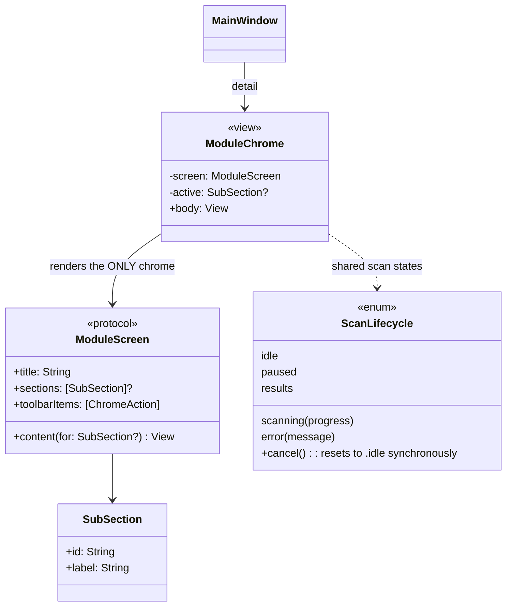

# Navigation & page chrome — audit and readjustment plan

Date: 2026-09-18 · Scope: `Sources/CoreTendApp` · Status: plan, not yet implemented

## 1. The question

> « Est-ce que dans le code il y a un recodage complet de la nav pour chaque menu ? »

**Non — pas pour la navigation primaire. Oui — pour la sous-navigation et le
chrome de page.** Les deux réponses tiennent ensemble, et c'est exactement ce
qui produit l'incohérence visible à l'écran.

## 2. What is actually centralized (and is correct)

One single `NavigationSplitView`, declared once, in `CoreTendApp.swift:383`.

```mermaid
classDiagram
    class ModuleID {
        <<enum>>
        +smartCare, cleanup, protection, performance
        +applications, duplicates, myClutter, spaceLens
        +cloudCleanup, myActivity, settings
        +label: String
        +icon: String
    }
    class SidebarGroup {
        +id: String
        +title: String?
        +modules: [ModuleID]
        +all: [SidebarGroup]$
        +visibleModules: [ModuleID]$
    }
    class MainWindow {
        -selection: ModuleID?
        +body: NavigationSplitView
    }
    MainWindow --> SidebarGroup : renders List(selection:)
    SidebarGroup "1" --> "*" ModuleID
    MainWindow ..> ModuleID : switch selection -> detail view
```

Aucune vue module ne redéclare de `NavigationSplitView`, de `List` de sidebar,
ni de sélection. Le routage est un unique `switch selection` (11 branches).
Vérifié : `grep -c NavigationSplitView Sources/CoreTendApp/*.swift` → 1 seule
occurrence, dans `CoreTendApp.swift`.

Donc : **pas de dette de routage**. La dette est ailleurs.

## 3. What is NOT centralized (and is the real defect)

Chaque vue module invente son propre chrome de page. Inventaire mesuré :

| Vue | `navigationTitle` | Sous-nav | Idiome de sous-nav | `toolbar` | Recherche |
|---|---|---|---|---|---|
| DashboardView | 1 | — | — | 0 | — |
| CleanupView | 1 | — | — | 0 | — |
| SpaceLensView | 1 | — | — | **2** | — |
| DuplicatesView | 1 | — | — | 0 | interne |
| **ApplicationsView** | 1 | 1 | **`TabView` (pilules)** | 0 | `TextField` interne |
| **MyClutterView** | 1 | 2 | **`Picker(.segmented)` + `safeAreaInset`** | 0 | — |
| **ProtectionView** | 1 | 1 | **`Picker(.segmented)` + `safeAreaInset`** | 0 | — |
| CloudCleanupView | 1 | — | — | 0 | — |
| PerformanceView | 1 | — | — | 0 | — |
| MyActivityView | 1 | — | — | 1 | — |
| SimilarImagesView | **0** | — | — | 0 | — |
| PrivacyCleanerView | **0** | — | — | 0 | — |
| LeftoversView | **0** | — | — | 0 | — |

Trois conséquences directes, toutes visibles sur les captures de la 1.0.1 :

1. **Trois idiomes pour un seul concept.** Un onglet secondaire est rendu en
   pilules flottantes (`Applications`), en segmented control épinglé
   (`Protection`, `My Clutter`), ou n'existe pas (les 8 autres). L'utilisateur
   apprend trois grammaires pour la même chose.
2. **Deux niveaux de maître-détail en compétition.** `ApplicationsView` place un
   split maître/détail *à l'intérieur* du détail : une seconde colonne de liste
   apparaît à côté de la vraie sidebar. Rien d'autre dans l'app ne fait ça.
3. **Un `TabView` en détail de `NavigationSplitView`** — `ApplicationsView.swift:269`
   — c'est précisément la construction que le code lui-même documente comme
   dangereuse dans `ProtectionView.swift:71-73` et `MyClutterView.swift:137-138` :

   > « a TabView as a NavigationSplitView detail can intermittently blank the
   > split view's sidebar on macOS »

   Deux vues ont été corrigées, la troisième ne l'a jamais été. C'est le
   candidat principal pour la sidebar vide rapportée en 1.0.1 et reproduite sur
   l'app publiée.

Trois vues (`SimilarImagesView`, `PrivacyCleanerView`, `LeftoversView`) n'ont
aucun titre : elles sont des sous-écrans, mais rien dans le type ne le dit — la
distinction « module » / « sous-écran » n'existe qu'implicitement.

## 4. Target architecture



Règles de la cible :

- **Un seul composant `ModuleChrome`** rend le titre, la sous-navigation et les
  actions de toolbar. Une vue module ne déclare plus jamais `navigationTitle`,
  `safeAreaInset`, `Picker(.segmented)` de sous-nav ni `TabView`.
- **Un seul idiome de sous-navigation** : segmented control épinglé sous la
  barre de titre (celui déjà validé sur `Protection` / `My Clutter`, et qui ne
  blanchit pas la sidebar). `TabView` est interdit en détail — à faire respecter
  par un test.
- **`ScanLifecycle` partagé.** Les 6 vues de scan répètent aujourd'hui la même
  machine à états avec des divergences (cf. §5). Un seul type, avec `cancel()`
  qui remet `.idle` de façon synchrone.
- **`ModuleID` reste la seule source de vérité** du routage et des libellés.

## 5. Related defect the same refactor closes

`AsyncStream.Iterator.next()` est sensible à l'annulation : la boucle
`for await` sort **avant** de consommer l'évènement `.cancelled` du producteur.
Donc `case .cancelled: phase = .idle` est du **code mort** dans 5 view models
(`CleanupView`, `DuplicatesView`, `SpaceLensView`, `MyClutterView`,
`SimilarImagesView`). Reproduit par un programme Swift autonome :

```
boucle sortie — dernier évènement reçu: progress
le consommateur a-t-il reçu .cancelled ? NON
```

Effet utilisateur : le CPU s'arrête bien, mais l'UI reste en `.scanning` —
spinner infini, bouton Cancel qui « ne marche pas », et scan impossible à
relancer à cause des gardes du type `guard phase != .scanning else { return }`
(`CleanupView.swift:70`). `CloudCleanupView.swift:142` fait déjà la bonne chose.
Centraliser `cancel()` dans `ScanLifecycle` corrige les 5 d'un coup et rend la
régression impossible à réintroduire vue par vue.

## 6. Plan, ordonné par risque décroissant

| # | Lot | Portée | Gate |
|---|---|---|---|
| 1 | `ScanLifecycle.cancel()` synchrone, 5 view models migrés | comportement | test unitaire par vue : `cancel()` → `phase == .idle` |
| 2 | `ApplicationsView` : `TabView` → segmented épinglé | visuel + crash | test structurel : `TabView` absent de `Sources/CoreTendApp` |
| 3 | `ModuleChrome` extrait, 10 modules migrés | cohérence | capture visuelle par module, sidebar non vide |
| 4 | `ApplicationsView` : split imbriqué → liste + détail poussé | cohérence | revue design |
| 5 | Sous-écrans typés (`SimilarImages`, `PrivacyCleaner`, `Leftovers`) | typage | compilation |
| 6 | Findings P0/P1 de l'audit typage (store silencieux, rejets d'approbation invisibles, `.fileVanished` fourre-tout) | sûreté des données | tests de régression dédiés |

Chaque lot = une PR, `bash Scripts/test.sh` vert, capture visuelle jointe.

## 7. What this plan does NOT claim

Rien ici n'est vérifié par exécution au-delà de : l'inventaire du tableau §3
(mesuré par `grep`), l'unicité du `NavigationSplitView`, la reproduction de la
sidebar vide sur l'app 1.0.1 publiée (capture `duplicates.png`), et la
reproduction du bug d'annulation (programme autonome §5). Le lien de causalité
entre le `TabView` de `ApplicationsView` et la sidebar vide observée sur
`Duplicates` reste une hypothèse forte, pas une preuve : la sidebar s'est
rétablie sur l'écran suivant, ce qui indique un défaut transitoire de
transition. Le lot 2 est justifié indépendamment.
