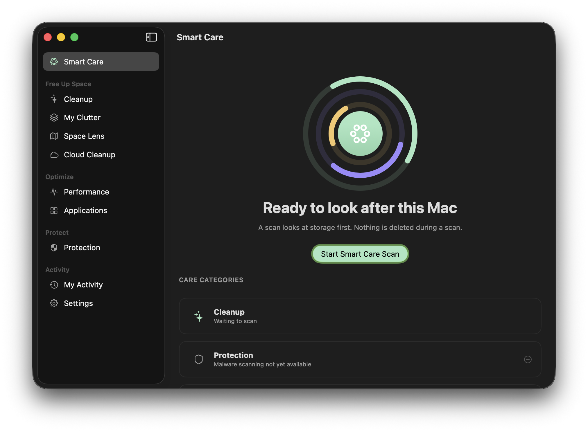
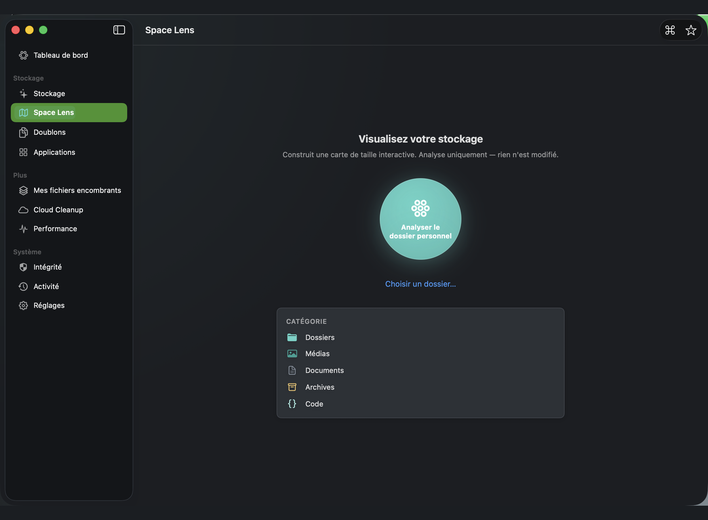
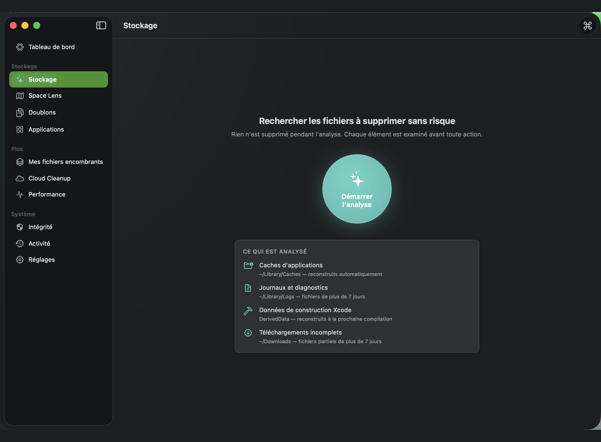

# CoreTend

<p align="center">
  <picture>
    <source media="(prefers-color-scheme: dark)" srcset="Resources/Brand/Generated/Logo-Horizontal-dark@2x.png">
    
  </picture>
</p>

<p align="center"><strong>Know what your Mac is holding. Take the space back.</strong></p>

<p align="center">
  Local, transparent and reversible care for macOS. CoreTend reads supported
  locations on-device and explains every finding. Nothing leaves your Mac;
  sensitive actions need a reviewed selection and explicit confirmation before
  eligible items go to the Trash.
</p>

<p align="center">
  <a href="https://github.com/ahmetbsbnr/coretend/releases/latest"></a>
  
  
  <a href="LICENSE"></a>
</p>

<p align="center">
  
</p>

<p align="center">
  <a href="https://coretend.ahmetbsbnr.com">Product site</a> ·
  <a href="https://ahmetbsbnr.com/en/projets/coretend/">Portfolio case study</a> ·
  <a href="Documentation/README.md">Documentation</a>
</p>

---

## What it does

| | |
|---|---|
| **Storage** | Scans caches, logs, crash reports and build data, then shows every candidate before anything can move to the Trash. |
| **Space Lens** | A radial size map — the largest folder at the centre, siblings orbiting it, bubble area proportional to bytes. Descend, search, reveal in Finder. |
| **Duplicates** | Exact-content matches by staged hashing. One copy per group is always kept; the suggestion is editable. |
| **Applications** | Separates apps from their caches, agents and personal documents so an uninstall is complete. |
| **Integrity** | Native macOS signals only — download provenance, code-signature tiers, and what launches at login. Not malware detection. |
| **Activity** | A local log of every scan and every reversible action. |

A secondary **More** group holds **Large & Old files**, **Cloud Cleanup**
(local-vs-cloud storage analysis, never triggers a download) and
**Performance** (live CPU / memory history, broken-LaunchAgent detection).

<p align="center">
  
  
</p>

## Install

The current release is
[`v1.0.0`](https://github.com/ahmetbsbnr/coretend/releases/tag/v1.0.0), a
**Developer ID signed, Apple-notarized and stapled** stable build
(`sourceCommit 0ecddea`).

1. Download `CoreTend-1.0.0-arm64.dmg` from the
   [release page](https://github.com/ahmetbsbnr/coretend/releases/tag/v1.0.0),
   or use the site's [`/download`](https://coretend.ahmetbsbnr.com/download) link.
2. Optionally verify it:
   ```sh
   shasum -a 256 ~/Downloads/CoreTend-1.0.0-arm64.dmg
   # 0969ea2565b98fc950a589855ebafa2b811474fd1383092c3567e192f404534d
   ```
3. Open the DMG and drag **CoreTend** to Applications.

The notarization ticket is stapled, so the app opens without a Gatekeeper
prompt. macOS 14+ and Apple silicon (`arm64`) are required. Provenance is
covered by Minisign + SHA-256 + notarization; there is no
`actions/attest-build-provenance` attestation for this manually published
1.0.0 release. Future releases use a dedicated signing runner so Developer ID
signing, notarization, SLSA attestation, SHA-256, and Minisign all cover the
same final bytes.

## Build and test

Pure SwiftPM — no Xcode project.

```sh
swift build -c release
bash Scripts/test.sh                    # 340 tests, never raw `swift test`
python3 Scripts/check-demo-fixtures.py
python3 Scripts/test-public-release-gate.py
python3 Website/build.py --output /tmp/coretend-site-dist
```

`bash Scripts/package-local.sh` assembles a runnable `build/CoreTend.app` from
the release binary. The website build is self-contained: fonts, release facts,
`latest.json` and `SHA256SUMS` are generated from reviewed repository inputs.

## Privacy and safety

No account, no advertising telemetry, no analytics SDK. Scan data and activity
stay in the local app store. The only product network request is a
user-initiated update check for the public `latest.json` manifest. Destructive
engines route through `SafetyCore.PathValidator`; every removal is a validated
move to the macOS Trash and stays reversible until the Trash is emptied. See
[`PRIVACY.md`](PRIVACY.md) and [`SECURITY.md`](SECURITY.md).

## Repository guide

- [`Documentation/README.md`](Documentation/README.md) — maintained index
- [`CONTRIBUTING.md`](CONTRIBUTING.md) — development and review expectations
- [`DESIGN.md`](DESIGN.md) · [`DEVELOPMENT.md`](DEVELOPMENT.md) — design system and working rules
- [`LICENSE`](LICENSE) · [`NOTICE`](NOTICE) · [`THIRD_PARTY_NOTICES.md`](THIRD_PARTY_NOTICES.md)
- [`SUPPORT.md`](SUPPORT.md) — support route

## License

Source code is Apache-2.0. Documentation and original media retain the terms
listed in the repository notices.
