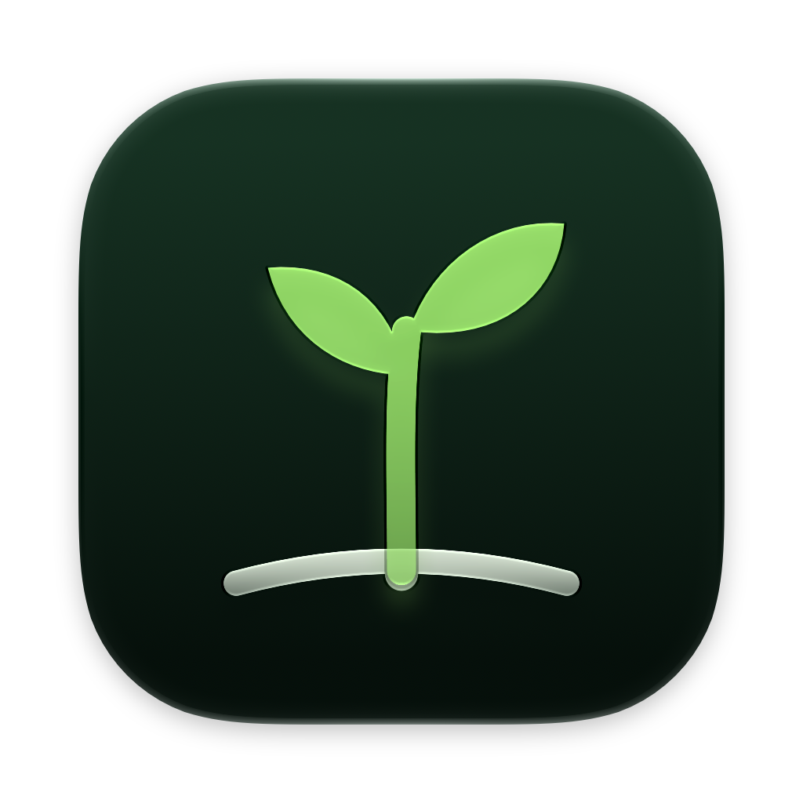
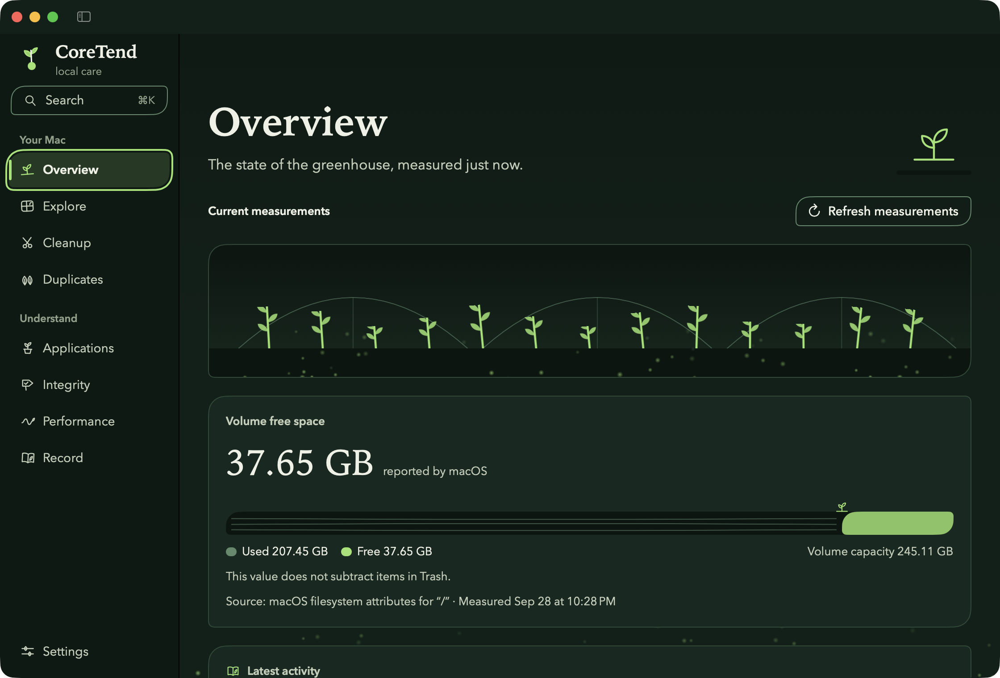

<p align="center">
  
</p>

<h1 align="center">CoreTend</h1>

<p align="center"><strong>A living greenhouse for your Mac.</strong><br>
See what takes space, understand it, and prune only what you choose — every move goes to the Trash.</p>

<p align="center">
  <a href="https://github.com/ahmetbsbnr/coretend/releases/latest"></a>
  
  
  <a href="LICENSE"></a>
</p>

<p align="center">
  <a href="https://coretend.ahmetbsbnr.com">Website</a> ·
  <a href="https://coretend.ahmetbsbnr.com/en/download">Download</a> ·
  <a href="CHANGELOG.md">What's new in 2.0</a> ·
  <a href="https://coretend.ahmetbsbnr.com/fr/index">Français</a>
</p>

<p align="center">
  
</p>

---

## Eight tools, one greenhouse

| Tool | What it does |
|---|---|
| **Overview** | Free space measured by macOS, the soil band of your volume, recent activity and why. |
| **Explore** | Choose a folder; every file and subfolder becomes a plot sized by what it takes. Walk into folders, search, sort, preview. |
| **Cleanup** | Seven rules for known places (caches, logs, crash reports, Xcode data, unfinished downloads, iOS backups), each with its risk. Nothing preselected. |
| **Duplicates** | Exact copies by content and the space keeping one would free. You choose the copy that stays — it can never be moved. |
| **Applications** | Every app of a folder with icon, version and real size; sort by size; move one bundle to the Trash after review. |
| **Integrity** | What macOS records about an app — signature, quarantine marker — for one app or a whole folder. Signals, never a verdict. |
| **Performance** | Load, memory in use, thermal state, each with its source; readings only when you look. |
| **Record** | Everything observed and moved, one page per day; export or clear it. |

## What CoreTend will never do

- **Erase anything for good.** Moves go to the macOS Trash, after your selection, review and confirmation, and CoreTend checks each file again just before.
- **Ask for Full Disk Access** or your password. You choose each folder it may read.
- **Phone home.** No network, no account, no telemetry.

## Install

- **Download** `CoreTend-2.0.0-arm64.zip` (notarized) from [Releases](https://github.com/ahmetbsbnr/coretend/releases/latest), unzip it and move CoreTend into Applications.
- **Homebrew:** `brew install --cask coretend`

macOS 14 Sonoma or later, Apple silicon. English and French. CoreTend 2.0 replaces 1.x; your 1.x data are not touched and its preferences can be imported from Settings.

## Build from source

```sh
swift build --product CoreTendApp   # the app
swift build --product CoreTendCLI   # a read-only command-line tool
make qualify                        # every test, gate and check
make package-local                  # an unsigned CoreTend.app in Artifacts/
```

Swift 6, SwiftPM, no runtime dependency. The code is organised in modules: `DesignSystem` (the Serre
design and the living greenhouse), `ScanCore` (read-only scanning), `SafetyCore` (the only code that
may move a file — to the Trash), `Domain`, `Persistence`, `AppShell` and the app itself.

## Contributing

Read [CONTRIBUTING.md](CONTRIBUTING.md) and [GOVERNANCE](.github/GOVERNANCE.md). Security issues:
[SECURITY.md](SECURITY.md). Code under [Apache 2.0](LICENSE), documentation under CC BY 4.0.
