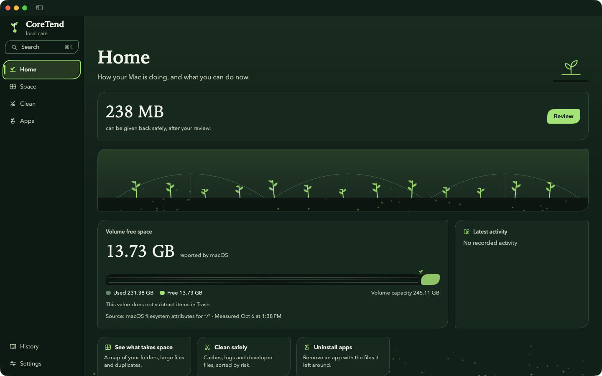

<p align="center">
  
</p>

<h1 align="center">CoreTend</h1>

<p align="center"><strong>See what fills your Mac. Clear it safely.</strong><br>
Your whole Mac in one click, caches and developer files cleaned in one review, apps uninstalled completely — everything goes to the Trash, with Undo.</p>

<p align="center">
  <a href="https://github.com/ahmetbsbnr/coretend/releases/latest"></a>
  <a href="https://www.npmjs.com/package/coretend"></a>
  
  
  <a href="LICENSE"></a>
</p>

<p align="center">
  <a href="https://coretend.ahmetbsbnr.com">Website</a> ·
  <a href="https://coretend.ahmetbsbnr.com/en/download">Download</a> ·
  <a href="CHANGELOG.md">What's new in 2.1</a> ·
  <a href="https://coretend.ahmetbsbnr.com/fr/index">Français</a>
</p>

<p align="center">
  
</p>

---

## Four spaces

| Space | The question it answers |
|---|---|
| **Home** | How is my Mac, and what can I do now? The space CoreTend can give back, one button away. |
| **Space** | What takes the space? A map of your home folder, large files and exact duplicates. |
| **Clean** | What can I remove safely? 14 rules read at once — caches, logs, Xcode, simulators, npm, pnpm, Gradle, Cargo, Mail — safe items ticked, one review, Undo. |
| **Apps** | Which apps take space or start on their own? Uninstall completely: the app and the files it left. |

History of every scan and move stays at the sidebar's foot.

## What CoreTend will never do

- **Erase anything for good.** Moves go to the macOS Trash after your review; CoreTend checks each
  item again just before, and Undo puts it back.
- **Scare you.** No health score, no alarm, no invented figure.
- **Watch you.** No account, no telemetry. The only request asks this site whether an update
  exists, and you can turn it off in Settings.

## Install

- **Download** `CoreTend-2.1.0-arm64.dmg` (notarized) from [Releases](https://github.com/ahmetbsbnr/coretend/releases/latest) or the [site](https://coretend.ahmetbsbnr.com).
- **Homebrew:** `brew install --cask ahmetbsbnr/coretend/coretend` (also links `coretend` in your PATH)
- **Terminal and AI assistants:** [`coretend` on npm](https://www.npmjs.com/package/coretend) — `npx coretend clean` · `npx -y coretend mcp`; see [CLI.md](Documentation/CLI.md).

macOS 14 Sonoma or later, Apple silicon. English and French (follows macOS). CoreTend asks for Full
Disk Access once, to read Mail, Safari and app data; without it, it reads what macOS allows.

## Build from source

```sh
swift build --product CoreTendApp   # the app
swift build --product CoreTendCLI   # a read-only command-line tool
make qualify                        # every test, gate and check
make package-local                  # an unsigned CoreTend.app in Artifacts/
```

Swift 6, SwiftPM; one runtime dependency, [Sparkle](https://sparkle-project.org), for signed updates. The code is organised in modules: `DesignSystem` (the Serre
design and the living greenhouse), `ScanCore` (read-only scanning), `SafetyCore` (the only code that
may move a file — to the Trash), `Domain`, `Persistence`, `AppShell` and the app itself.

## Contributing

Read [CONTRIBUTING.md](CONTRIBUTING.md) and [GOVERNANCE](.github/GOVERNANCE.md). Security issues:
[SECURITY.md](SECURITY.md). Code under [Apache 2.0](LICENSE), documentation under CC BY 4.0.
